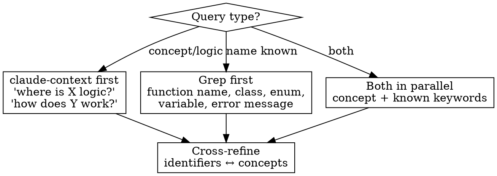
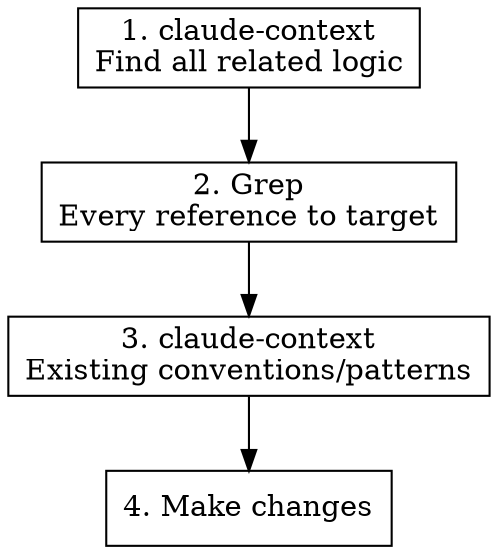

# Hybrid Code Search

Combine claude-context semantic search with Grep for precise, comprehensive code exploration and safe code modification.

## When to Use

- Exploring code logic or architecture ("Where is the booking confirmation logic?")
- Finding implementations across multiple codebases
- Before modifying code — understanding impact scope
- After modifying code — verifying completeness
- Searching for patterns, conventions, or usage sites

## When NOT to Use

- Reading a specific file you already know the path to — use Read
- Simple file name search — use Glob directly

## Phase 0: MCP Availability Check

Before anything, check if `mcp__claude-context__*` tools are available.

**If NOT available:** Stop and warn the user:

> claude-context MCP server is not configured.

## Path Rules (CRITICAL)

**NEVER append trailing slash to paths.** This causes false "not indexed" errors.

```
WRONG:  /Users/foo/project/
CORRECT: /Users/foo/project
```

## Protocol

### Phase 1: Index Verification

**ALWAYS check index status before any search.** Never skip this step.

```
mcp__claude-context__get_indexing_status(path="/absolute/path/to/codebase")
```

- Indexed → proceed to Phase 2
- Not indexed → proceed to Phase 1.5 (Exclusion Analysis)
- Multiple codebases → check each status

### Phase 1.5: Pre-Index Exclusion Analysis

**When codebase is not indexed, analyze the project BEFORE indexing.** This improves search quality by excluding irrelevant files.

claude-context automatically excludes: `.gitignore` patterns, `node_modules/`, `dist/`, `build/`, `.git/`, `.vscode/`, `.idea/`, `__pycache__/`, `.env`, `*.min.js`, `*.map`, etc.

**Focus only on finding exclusion candidates NOT already covered by defaults or `.gitignore`.**

#### Step 1: Scan Project Structure

```bash
# Find large directories that may need exclusion
du -sh /path/to/codebase/*/ 2>/dev/null | sort -rh | head -20
```

#### Step 2: Identify Additional Exclusion Candidates

Look for items **not covered** by defaults or `.gitignore`:

| Category | Examples |
|----------|----------|
| Large data files | `*.csv`, `*.sql`, large `*.json` |
| Generated code | `*.generated.*`, `*.pb.go` |
| Test fixtures / snapshots | `fixtures/`, `__snapshots__/`, `testdata/` |
| Legacy / archived code | `docs/legacy/`, `old/`, `deprecated/` |
| Vendored dependencies | `third_party/`, `external/` |

#### Step 3: Present & Index

Summarize recommended additional exclusions and ask the user to confirm. Then index:

```
mcp__claude-context__index_codebase(
  path="/absolute/path/to/codebase",
  ignorePatterns=["fixtures/**", "*.csv", "docs/legacy/**"]
)
```

For persistent exclusions, recommend creating a `.contextignore` file in the codebase root instead.

**Re-indexing:** To update exclusions on an already-indexed codebase, use `force=true`.

### Phase 2: Choose Search Strategy



| Signal | Start with | Then refine with |
|--------|-----------|-----------------|
| "where/how does X work?" | claude-context | Grep (found identifiers) |
| Exact function/class/enum name | Grep | claude-context (broader context) |
| Concept + specific keyword | Both parallel | Cross-reference results |
| Insufficient first results | Switch tool | Rephrase query, try other language |

### Phase 3: Execute Search

**Semantic search tips:**
- Use descriptive natural language: `"confirm booking status transition"`
- Set `limit=15` for broad exploration, `limit=5` for targeted
- Rephrase with different keywords if results are insufficient — don't repeat same query

**Grep tips:**
- Use for exact identifiers: function names, enum values, constants
- Search across file types with `glob` parameter
- Use `output_mode="content"` with context lines to understand usage

**Multi-codebase:** Always search all indexed codebases in parallel:
```
search_code(path="/path/to/codebase-a", query="...")  # parallel
search_code(path="/path/to/codebase-b", query="...")  # parallel
```

### Phase 4: Cross-Refine

After initial results:
1. Extract identifiers from semantic results (function names, types, constants)
2. Grep those identifiers to find all usage sites
3. If Grep found unexpected patterns, use semantic search to understand them
4. Read key files to confirm understanding

## Code Modification Workflow

When the task involves **changing code**, search is not optional.

### Before Modification



1. **claude-context** — find all related logic and patterns for the thing being changed
2. **Grep** — find every reference to the function/type/variable being modified
3. **claude-context** — check existing conventions to maintain consistency

### After Modification

4. **Grep** — re-search changed identifiers, compare count with step 2 to confirm no sites were missed
5. **Grep** — verify new code matches existing patterns (naming, error handling, etc.)

## Common Mistakes

| Mistake | Fix |
|---------|-----|
| Trailing slash in path | Always omit: `/path/to/codebase` not `/path/to/codebase/` |
| Search without checking index | Always `get_indexing_status` first |
| Only semantic search | Grep exact identifiers found in semantic results |
| Only Grep | claude-context for conceptual/cross-cutting concerns |
| Same query repeated | Rephrase with different keywords |
| Skip search before code changes | Always analyze impact scope first |
| Search one codebase only | Search all indexed codebases in parallel |
| Ignore cross-codebase interactions | API ↔ booking server calls — check both sides |
| Index without exclusion analysis | Always scan project structure and present exclusion plan before first index |
| Forget .gitignore is auto-respected | Don't duplicate .gitignore patterns in ignorePatterns |
